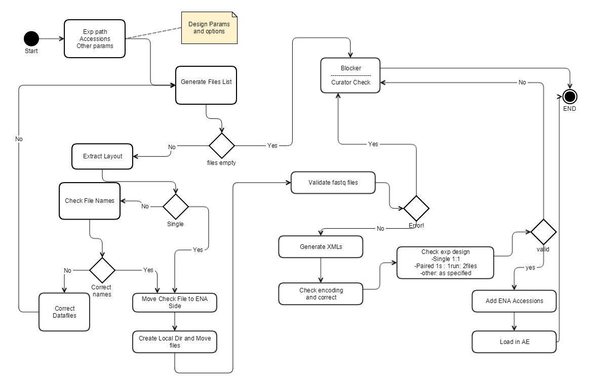

..  _ena:
ENA
===
Background
-----------
    ArrayExpress was first designed as a repository for microarray experiments.
By the beginning of the current millennium, DNA and RNA sequencing technologies have been introduced.
Hence, came the need to work-around ArrayExpress to hold sequencing and high throughput studies.

    With |ena_url| , raw data now can be stored at ENA with having the metadata analysed, curated, and stored in ArrayExpress.
This process has been done for years manually by curators, which takes lots of time and effort in addition to the introduction of human errors.

This module is responsible for handling the automatic submission of a sequencing project to ENA,
linking its components to An ArrayExpress experiment, and finally load the experiment into ArrayExpress .

Workflow
--------

   ENA Brokering Pipeline Workflow

The diagram above shows the state diagram of the ENA brokering pipeline.

Code and Inline Documentation
----------------------------

:mod:`ena` Package
------------------

.. automodule:: automation.ena
    :members:
    :undoc-members:
    :show-inheritance:

:mod:`add_ena_accessions` Module
--------------------------------

.. automodule:: automation.ena.add_ena_accessions
    :members:
    :undoc-members:
    :show-inheritance:

:mod:`ena_brokering` Module
---------------------------

.. automodule:: automation.ena.ena_brokering
    :members:
    :undoc-members:
    :show-inheritance:

:mod:`ena_experiment` Module
----------------------------

.. automodule:: automation.ena.ena_experiment
    :members:
    :undoc-members:
    :show-inheritance:

.. |ena_url| raw:: html

    <a href="http://www.ebi.ac.uk/ena" target="_blank">The European Nucleotide Archive (ENA)</a>

